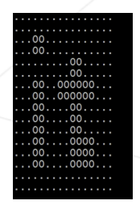

# Day 5
## JAR

Summary: Today you will learn to create library archives and use external libraries

Any Java library or framework is a set of JAR files archives of compiled classes and other resources.

Thus, the goal of any Java developer is to correctly organize the source code and then transfer the compiled JAR archive with implemented functionality to another programmer.

There is a range of tools to organize the project building life cycle and its structure. Nevertheless, certain skills of using standard Java infrastructure tools guarantee the correct understanding of how out-of-the-box and popular solutions work.

Today, you will manually build an application with external libraries. This is your first step in learning Maven the most popular building system.

## Exercise 00
Turn-in directory : *ex*00*/* \
Files to turn in : ImagesToChar-folder (exclude target) \
Allowed functions : All

Code can be organized on different levels. Packages are one of the code organization methods where classes are located in individual folders.

Now your task is to implement functionality that prints a two-colored image in the console.

An example of a black-and-white BMP image (this format is mandatory for the solution). Image size is 16\*16 pixels.

You can find this image in the project page.

Your application shall accept input parameters corresponding to characters that should be displayed in place of white and black pixels. Another main function startup parameter is the full path to the image on your disk.

If "." character is used for white color and "0" for black, the image in the console may look as follows:

Application logic must be distributed between different packages and have the following structure:

- README.txt file must contain instructions for compiling and starting your source code from the console (non-IDE). Instruction is written for the state where the console is opened in the project’s root folder.

## Exercise 01
Turn-in directory : *ex*01*/* \
Files to turn in : ImagesToChar-folder (exclude target) \
Allowed functions : All

Now you need to create a distribution package of the application a JAR archive. It is important that the image be contained in that archive (a command-line parameter for the full path to the file is not required in this task).

The following project structure shall be adhered to:

- Archive and all compiled files shall be put in target folder during assembly (without a manual file transfer; you may apply cp command to the resource folder).
- README.txt file should also contain information on the archive assembly and startup.

## Exercice 02
Turn-in directory : *ex*02*/* \
Files to turn in : ImagesToChar (excludelib and target) \
Allowed functions : All

Now you should use external libraries:

- JCommander for the command line.
- JCDP or JColor for using colored output

Archives with these libraries shall be downloaded and included in the previous task’s project.

Now application startup parameters shall be processed with JCommander tools. The image should be displayed using the "colored" output option of JCDP library.

Required project structure:

Example of program operation:

`$ java -jar images-to-chars-printer.jar -- white=RED --black=GREEN!`
